<div align="center">

# 🔌 VOLTMANCER · PLUGINS 🔌

### *Cross-machine Claude Code tools that travel with the human · one `/plugin install` away · zero portability tax*

</div>

<div align="center">


</div>

---

<table align="center" width="100%">
<tr>
<td width="50%" bgcolor="#1a1a2e" align="center">

### ⚡ THE 60-SECOND PITCH

A **Claude Code plugin marketplace** that turns my best
single-machine workflows into one-line installs.

Skills, agents, hooks, commands, MCPs — bundled,
versioned, **portable across every box I touch.**

Linux desktop. Work Mac. Future laptop.
**Same `/scriber`, same muscle memory.**

</td>
<td width="50%" bgcolor="#3a1a2e" align="center">

### 🎯 THE 5-SECOND BET

Tools that only live on one machine die on that machine.

Claude Code's plugin contract is **good enough now**
to make personal automation **survive a reformat,
a new job, a new continent.**

Voltmancer is the brand carrying that promise.

</td>
</tr>
</table>

---

## ⚡ Live Status — *what's actually shipped right now*

> Last updated: **2026-04-28** · phase **1** · `marketplace live · 1 plugin shipped`

<table>
<tr>
  <td align="center" bgcolor="#ffd75f"><b>🚦 PHASE</b><br/><font color="#000">1 — Marketplace</font></td>
  <td align="center" bgcolor="#87afff"><b>🎯 ACTIVE</b><br/><font color="#000">scriber v0.1.0</font></td>
  <td align="center" bgcolor="#2ecc71"><b>💚 BLOCKED</b><br/><font color="#000">— nothing</font></td>
  <td align="center" bgcolor="#ff87d7"><b>📍 NEXT</b><br/><font color="#000">v0.2 polish + plugin #2</font></td>
</tr>
</table>

<br/>

| | |
|---|---|
| **Shipped plugins** | `scriber` v0.1.0 — live session → Notion page |
| **In flight** | scaffolding for plugin #2 candidate · marketplace `update` rehearsal |
| **Last activity** | 2026-04-28 — README v3 visual upgrade |
| **Repo** | `git@github-atlas:itay-turgeman/voltmancer-plugins.git` (public) |
| **Install command** | `/plugin marketplace add github:itay-turgeman/voltmancer-plugins` |

### 📍 You are here on the roadmap


<details>
<summary><b>📜 Changelog</b> (click to expand)</summary>

- **2026-04-28** — README v3 ADHD-grade visual upgrade (mindmap, sankey, gantt, journey, sequence, pie, state, timeline)
- **2026-04-24** — Repo bootstrapped, marketplace.json declared, `scriber` v0.1.0 published, first cross-machine `/plugin install` confirmed working

</details>

---

## 🗺️ The whole marketplace in one picture

> 🎯 If you read **nothing else**, this mindmap is the project. Every other section expands one branch.

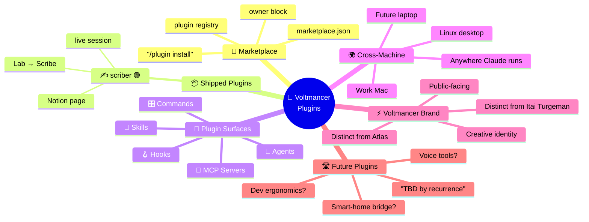

---

## 📑 Table of Contents

| | Section | Visual flavor |
|---|---------|--------------|
| 1 | [⚡ Why This Exists](#-why-this-exists) | quadrant |
| 2 | [⚡ The Voltmancer Brand](#-the-voltmancer-brand) | flowchart TD |
| 3 | [🛒 The Plugin Catalog](#-the-plugin-catalog) | catalog cards |
| 4 | [🧰 Plugin Anatomy](#-plugin-anatomy) | flowchart TD + subgraphs |
| 5 | [📦 Repo Architecture](#-repo-architecture) | file tree + flow |
| 6 | [🛒 Install Flow](#-install-flow) | flowchart LR |
| 7 | [♻️ Plugin Lifecycle](#-plugin-lifecycle) | sequenceDiagram |
| 8 | [🔁 Plugin States](#-plugin-states) | stateDiagram-v2 |
| 9 | [📅 Roadmap](#-roadmap) | gantt + pie |
| 10 | [🕰️ Project Timeline](#-project-timeline) | timeline |
| 11 | [🌅 A Day in the Life](#-a-day-in-the-life) | journey |
| 12 | [🚫 What We Will NOT Build](#-what-we-will-not-build) | table |
| 13 | [🛠️ Tech Stack](#-tech-stack) | flowchart TD |
| 14 | [🏢 Org Position](#-org-position) | flowchart TD |
| 15 | [🤝 Contributing](#-contributing) | sequence + checklist |
| 16 | [📖 Glossary](#-glossary) | table |

### 🎨 Diagram legend

| | | | | |
|---|---|---|---|---|
|  **gold** = active focus |  **magenta** = root / brand |  **sky** = primary subsystem |  **pink** = flow / verb |  **purple** = data / state |
|  **cyan** = external API |  **mint** = support / glue |  **dark gold** = physical / hardware |  **green** = shipped |  **red** = critical |

---

## ⚡ Why This Exists

Personal automation has a **portability problem**. Every clever shell function, every dotfile, every "I'll remember to copy this" script — they all rot the second you touch a new machine.

Claude Code's plugin contract solves this for one specific class of tooling: **agentic workflows.** A plugin is a self-contained bundle of skills, agents, hooks, commands, and MCP servers, distributed via a `marketplace.json`, installed by name, versioned by tag.

Voltmancer is the brand that carries those bundles **across every machine the human touches.**

### 📈 Where this sits vs other distribution paths

```mermaid
quadrantChart
    title Portability vs Personal-Fit
    x-axis Generic --> Personal
    y-axis One Machine --> Cross Machine
    quadrant-1 The Sweet Spot 🎯
    quadrant-2 Public OSS (general)
    quadrant-3 Personal scripts (rotting)
    quadrant-4 Dotfiles repo (manual sync)
    Voltmancer Plugins: [0.85, 0.9]
    Anthropic Plugins: [0.2, 0.95]
    Community Plugins: [0.4, 0.85]
    Atlas (Itay's brain): [0.95, 0.15]
    Personal shell aliases: [0.95, 0.25]
    Stowed dotfiles: [0.7, 0.55]
    One-off bash scripts: [0.6, 0.1]
```

> 🎯 **THIS LINE** — Voltmancer occupies the **personal-fit + cross-machine** quadrant. Anthropic's official plugins are great but generic. Atlas is hyper-personal but locked to a Linux box full of secrets. Voltmancer is *my* tools, *anywhere I run Claude*.

### 🪜 The portability ladder

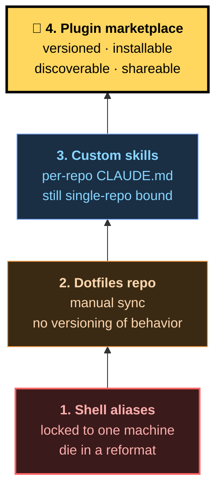

**Most personal automation lives at L1.** Voltmancer forces it up to L4. **That's the move.**

---

## ⚡ The Voltmancer Brand

Itay runs three identities, on purpose. Each one carries a different kind of work.

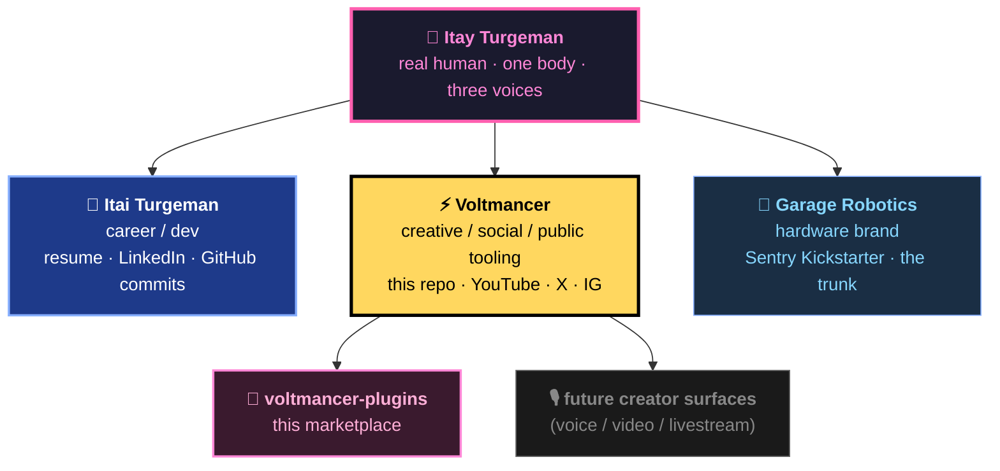

> 📌 **Why this repo lives under the Voltmancer name** — it's *public* and it's *personal*. Atlas is private and personal. Garage Robotics is public and product-focused. Voltmancer is where the loose, creative, "look what I made for myself and you can use it too" tools live.

---

## 🛒 The Plugin Catalog

### 🥧 What share each plugin type takes today

> Where the marketplace's mass currently sits. As more plugins ship, the wedge shifts — most likely toward agents and hooks.

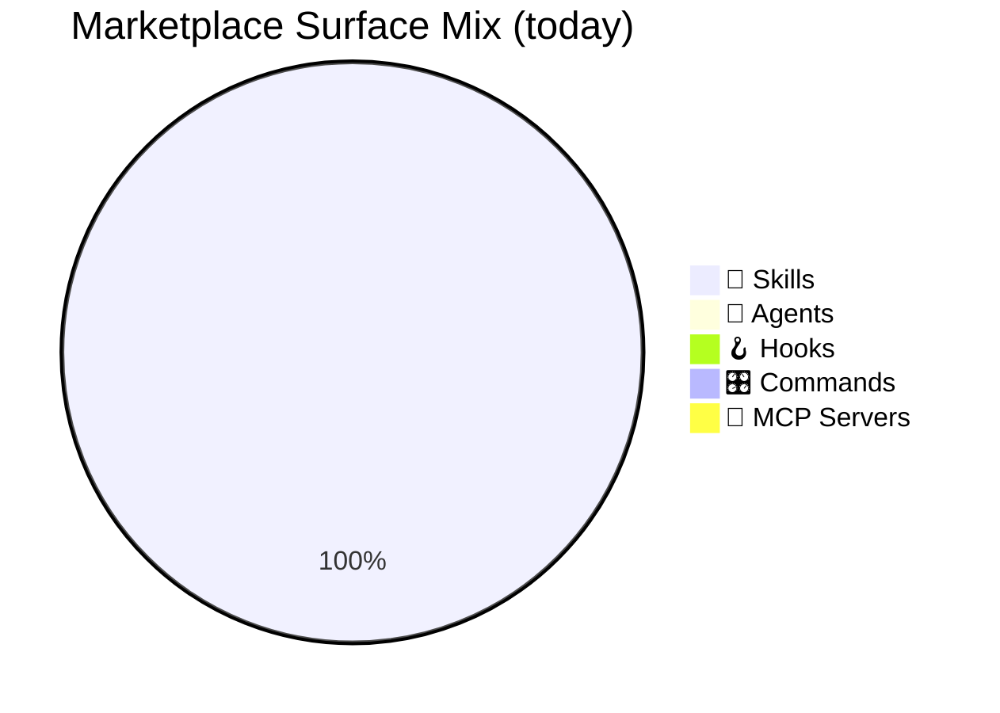

> 💡 The marketplace is intentionally **thin and honest**. One plugin, one surface. We add when a tool *recurs* across 3+ machines — not before.

### 📦 Plugin cards

<table>
<tr>
  <td width="50%" bgcolor="#1a1a2e" align="left" valign="top">

**✍️ scriber** · `v0.1.0` · 🟢 shipped

> Live session scribe into Notion. Builds a running page under `Lab → Scribe` with a `Now` block + adaptive sections (Timeline, Findings, Decisions, Open Questions, References) as you work. Hybrid manual/auto. Promotable to Lab Pipeline as a Draft.

| | |
|---|---|
| Surface | `📜 skill` |
| Trigger | `/scriber start <name>` |
| Backend | Notion MCP (account-scoped) |
| State dir | `~/.claude/scriber/sessions/` |

  </td>
  <td width="50%" bgcolor="#1a1a1a" align="left" valign="top">

**(slot reserved)** · `v—` · ⏸ deferred

> Next plugin lands when a workflow recurs across **≥3 machines**. Until then, the slot stays honest-empty. Candidates floating: voice-to-action capture, smart-home bridge for non-Atlas hosts, dev-ergonomics polish.

| | |
|---|---|
| Surface | TBD |
| Trigger | TBD |
| Status | candidate pool only |
| Bar to enter | "I missed it on machine #2" |

  </td>
</tr>
</table>

---

## 🧰 Plugin Anatomy

A Claude Code plugin is a directory with **five possible surfaces**. Voltmancer's plugins use whichever fit.

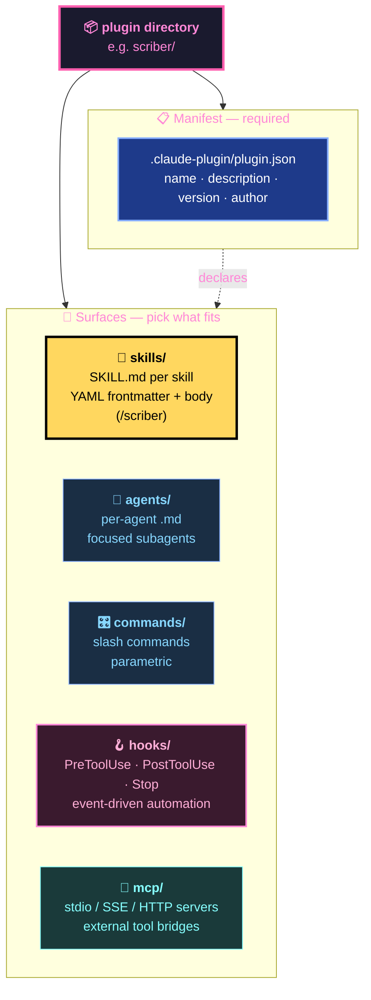

### 🧭 When to reach for which surface

| Surface | Use when | Don't use when |
|---------|----------|----------------|
| 📜 **Skill** | Multi-step workflow with named entry point a human would type | One-off explorations |
| 🤖 **Agent** | Focused subagent for a recurring scoped task | The work needs full session context |
| 🎛 **Command** | Parametric slash command, no decision tree | Workflow needs a state machine |
| 🪝 **Hook** | Behavior fires automatically on a Claude Code event | Behavior should be user-initiated |
| 🔗 **MCP** | Bridging an external service / API the plugin owns | Account-scoped MCP already covers it |

> 🎯 **Voltmancer's bias** — start with skills, graduate to agents when scope sharpens, add hooks only when the behavior should be silent and automatic. MCPs only if the plugin truly owns the integration.

---

## 📦 Repo Architecture

The marketplace is just a flat directory of plugins plus one manifest.

```
voltmancer-plugins/
├── 📋 .claude-plugin/
│   └── marketplace.json       ← the registry · owner block + plugin entries
├── ✍️ scriber/
│   ├── 📋 .claude-plugin/
│   │   └── plugin.json        ← name · description · version · author
│   └── 📜 skills/
│       └── scriber/
│           └── SKILL.md       ← the actual skill body + YAML frontmatter
├── 📜 README.md               ← this file
└── 🚫 .gitignore
```

### 🔁 How the manifest stitches it together

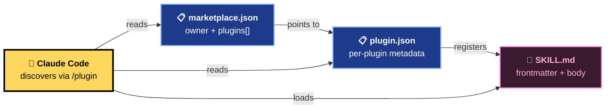

> 📌 **Why two manifests** — `marketplace.json` is the *outer* registry one repo can publish; `plugin.json` is the *inner* contract one plugin satisfies. The marketplace can host many plugins; each plugin can be installed independently.

---

## 🛒 Install Flow

The single most important user journey. From "fresh machine" to "/scriber works" in three commands.

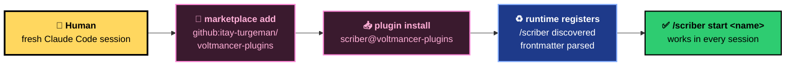

### 🖥 Install — fresh machine

```bash
# Inside Claude Code:
/plugin marketplace add github:itay-turgeman/voltmancer-plugins
/plugin install scriber@voltmancer-plugins
```

That's it. The skill registers as `/scriber` and is available in every session.

### 🧪 Local install — for testing before push

```bash
/plugin marketplace add ~/voltmancer-plugins
/plugin install scriber@voltmancer-plugins
```

### ♻️ Updating

```bash
/plugin marketplace update voltmancer-plugins
/plugin update scriber
```

> 💡 The whole point of this surface — *muscle memory transfers across machines*. Same three commands, same outcome, every box.

---

## ♻️ Plugin Lifecycle

The protocol between the human, the marketplace, and the runtime.

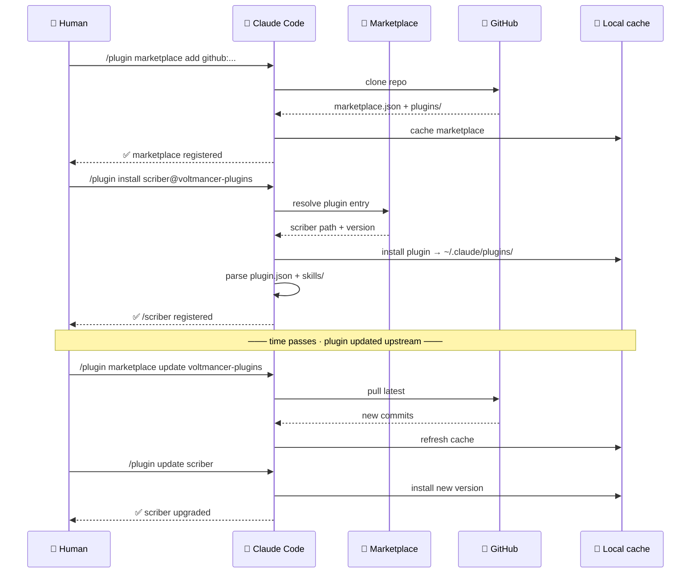

---

## 🔁 Plugin States

Every plugin in the marketplace lives one of these states. Today scriber is `Live`.

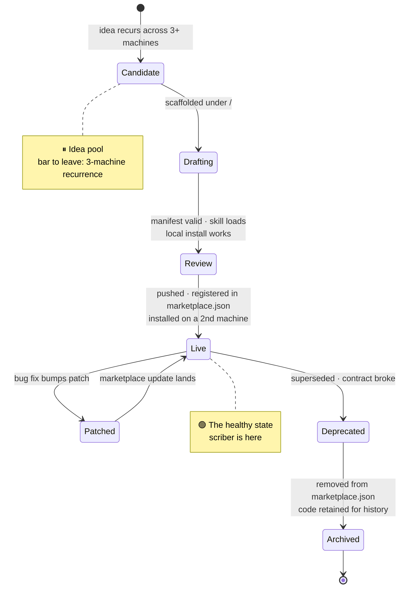

| State | Meaning | Color |
|-------|---------|-------|
| `Candidate` | Idea floating; not yet justified | gray |
| `Drafting` | Scaffolded locally; not in marketplace.json | yellow |
| `Review` | Local install verified end-to-end | sky |
| `Live` | Published; installable from GitHub | 🟢 green |
| `Patched` | Mid-update; transient | pink |
| `Deprecated` | Will be removed | 🟠 orange |
| `Archived` | Removed from registry; commit history retained | ⚫ dark |

---

## 📅 Roadmap

### 🗓️ As a Gantt — see the actual time shape

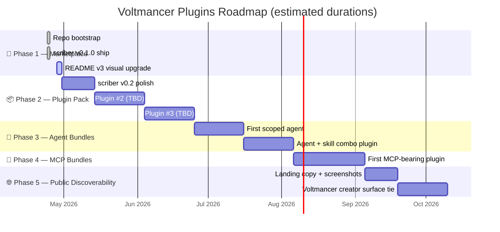

### 🥧 Phase 2 attention budget — where the next chunk of effort goes

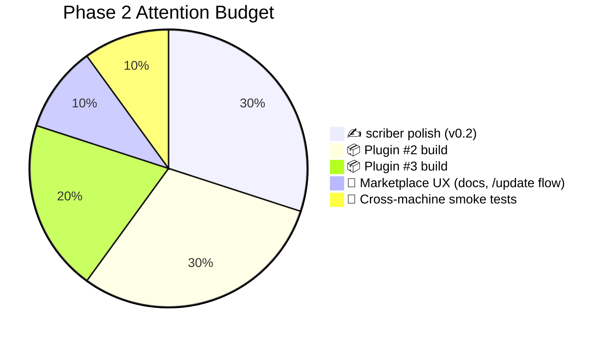

> 📌 **The bar to add a plugin** — it must already exist as friction across **3+ machines**. No speculative bundles. No "wouldn't it be cool" plugins. The marketplace stays honest.

---

## 🕰️ Project Timeline

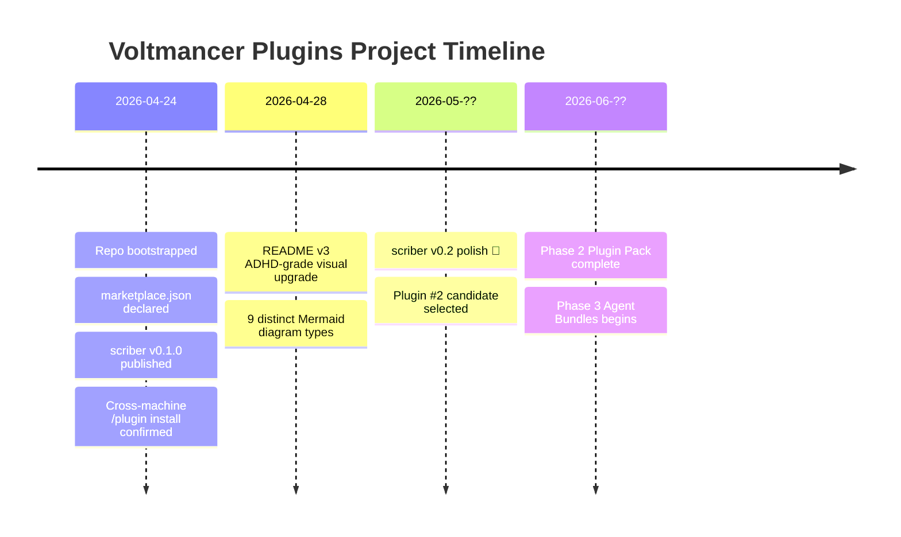

---

## 🌅 A Day in the Life

> *The journey from "new laptop in box" to "all my muscle memory works." This is what the marketplace exists to make trivial.*

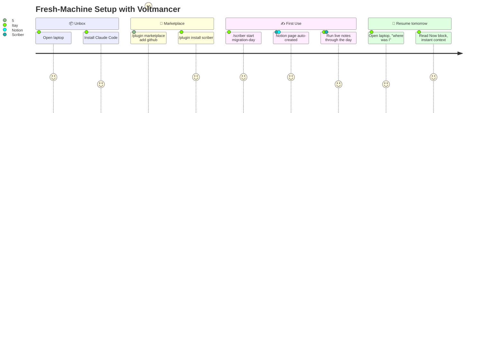

---

## 🚫 What We Will NOT Build

| Won't build | Why |
|-------------|-----|
| Atlas-internal automation as plugins | Atlas stays private + Linux-only; secrets don't travel |
| Garage Robotics product code | Wrong brand · wrong audience · wrong distribution |
| Auth-bearing plugins (API keys baked in) | Account-scoped MCPs already carry credentials; plugins must stay credential-free |
| Plugins that need a backing service we don't run | Portability dies the moment a plugin needs `voltmancer-cloud.com` |
| Speculative "wouldn't it be cool" plugins | Bar to publish: friction recurs across **3+ machines** |
| One-machine niche tools | If it only works on the Linux box, it belongs in `~/atlas/` not here |
| Closed-source plugins | The marketplace is public — closed code defeats the brand promise |
| Forks of upstream Anthropic plugins | Use upstream; don't fragment the ecosystem |

> ⚠️ Most personal-tool repos die because they accumulate **everything the author ever wrote.** Voltmancer's bar is deliberate scarcity — only what survives across machines, only what justifies a `/plugin install`.

---

## 🛠️ Tech Stack

> 🎯 **The stack is intentionally tiny.** Markdown + JSON + the Claude Code runtime. No build step. No package manager. The plugin contract IS the platform.

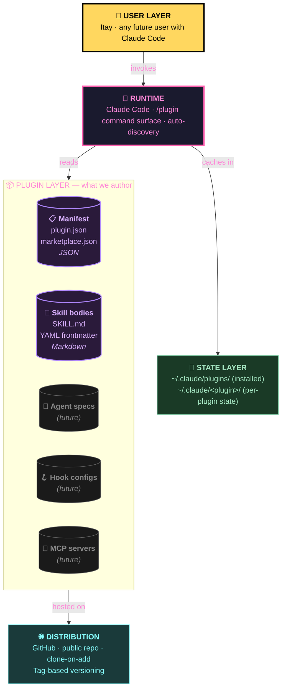

### 📋 The full stack inventory

| Layer | Today | Future |
|-------|-------|--------|
| **Authoring** | Markdown · JSON · YAML frontmatter | Same — no build step ever |
| **Distribution** | GitHub public repo · `git clone` under the hood | Optionally tags/releases for pinning |
| **Discovery** | `/plugin marketplace add` | Maybe a Voltmancer landing page (Phase 5) |
| **Runtime** | Claude Code · plugin auto-discovery | Same |
| **State** | `~/.claude/plugins/` cache · per-plugin state dirs | Same |
| **Versioning** | `plugin.json` `version` field · semver | Git tags once stability matters |

> 💡 The stack stays **boring on purpose**. Every interesting decision lives inside individual plugins, not in marketplace plumbing.

---

## 🏢 Org Position

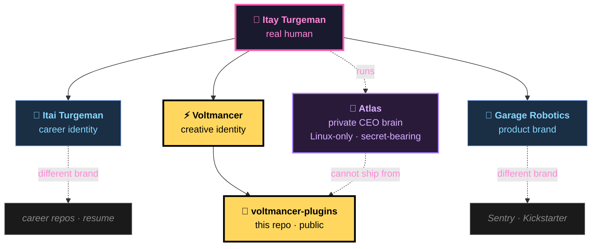

**voltmancer-plugins is intentionally orphan from Atlas.** Atlas is private, Linux-only, and full of personal-context secrets. This repo has to be installable on a work Mac, a borrowed laptop, anywhere. **Hard separation is the feature.**

> 📌 If a plugin idea ever needs Atlas state to function, it doesn't belong here. It belongs in Atlas.

---

## 🤝 Contributing

This is a personal marketplace — the bar to publish is "**Itay needs it on 3+ machines**" — but the install path is public, so the contribution surface is well-defined.

### 🛠️ Adding a new plugin (for future-Itay)

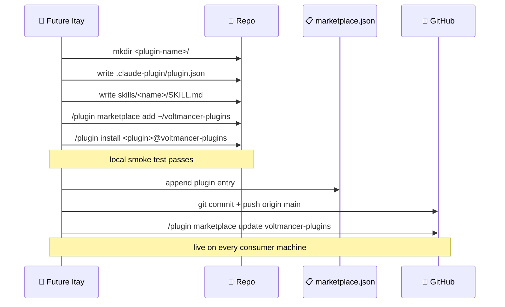

### ✅ Plugin checklist

- [ ] `<plugin>/.claude-plugin/plugin.json` exists with `name`, `description`, `version`, `author`
- [ ] At least one surface populated (`skills/`, `agents/`, `commands/`, `hooks/`, or `mcp/`)
- [ ] Local install works: `/plugin marketplace add ~/voltmancer-plugins` → `/plugin install <name>@voltmancer-plugins`
- [ ] Skill frontmatter `description` triggers correctly (auto-discoverable)
- [ ] No baked-in credentials, IPs, or host-specific paths
- [ ] No dependency on private services Itay runs
- [ ] Plugin entry appended to root `.claude-plugin/marketplace.json`
- [ ] Commit message is atomic and traceable

> 🎯 **The brand bar** — every plugin in this marketplace has to feel like *Voltmancer would actually ship this*. Slop scaffolds get rejected at the local-install gate.

---

## 📖 Glossary

| Term | Meaning |
|------|---------|
| **Voltmancer** | Itay's creative / public identity — the brand behind this repo |
| **Marketplace** | A `marketplace.json` registry pointing to one or more plugins, hosted in a single git repo |
| **Plugin** | Self-contained bundle of Claude Code surfaces (skills/agents/commands/hooks/MCP), versioned via `plugin.json` |
| **Plugin contract** | The Claude Code spec describing the `plugin.json` shape and the surfaces a plugin can declare |
| **Skill** | A markdown file with YAML frontmatter that registers as a slash command and runs as a multi-step workflow |
| **Agent** | A focused subagent (its own context window) for a recurring scoped task |
| **Hook** | An event-driven script bound to a Claude Code lifecycle event (PreToolUse, PostToolUse, Stop, etc.) |
| **MCP server** | A Model Context Protocol server bridging external tools/data into Claude |
| **`/plugin` command** | The Claude Code surface for marketplace + plugin management |
| **Atlas** | Itay's private CEO-level system (Linux-only). **Not** the home for Voltmancer plugins |
| **Garage Robotics** | Itay's hardware product brand. **Not** the home for Voltmancer plugins |
| **scriber** | First Voltmancer plugin · live session → Notion page · v0.1.0 |
| **Lab → Scribe** | Notion page hierarchy scriber writes into |

---

## 🎨 Visual Style

This README follows the [Atlas Diagram Style Guide](https://github.com/itay-turgeman/atlas/blob/main/docs/diagram-style-guide.md) — the canonical visual language for all Itay-org READMEs across `atlas`, `parallax`, `lola`, `sentry`, `reaper`, and (now) `voltmancer-plugins`.

### 📊 Diagram inventory used in this README

| Type | Used for | Count |
|------|----------|-------|
| `flowchart LR` | Roadmap position · install flow · manifest stitching · portability ladder | 4 |
| `flowchart TD` | Brand identity · plugin anatomy · tech stack · org position | 4 |
| `mindmap` | One-picture marketplace overview | 1 |
| `quadrantChart` | Portability vs personal-fit positioning | 1 |
| `pie` | Surface mix · attention budget | 2 |
| `sequenceDiagram` | Plugin install lifecycle · contribution flow | 2 |
| `stateDiagram-v2` | Plugin state machine (candidate → archived) | 1 |
| `gantt` | Roadmap with parallel tracks | 1 |
| `timeline` | Project history (no durations) | 1 |
| `journey` | Fresh-machine setup UX | 1 |

**10 distinct types, 18 Mermaid blocks** — keeps every section visually distinct so the eye doesn't blur.

---

<div align="center">

**🔌 Voltmancer · Plugins**
*Tools that travel with the human.*

`/plugin marketplace add github:itay-turgeman/voltmancer-plugins`

</div>
